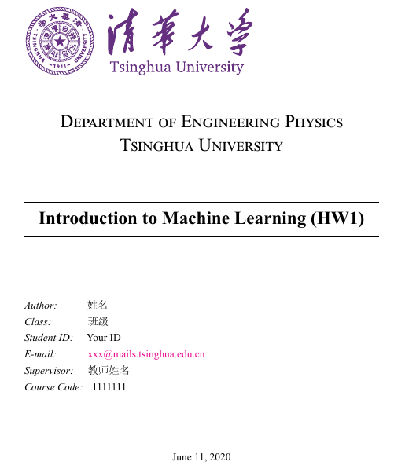

# THU-Homework-LaTex-Template
This is a LaTex template for THU homework which is suitable for math/physics/statistics/computer science and other related majors. This template is simple and may not meet all of your needs where you should improve it yourself.
# Requirements
XeLaTex
# Instructions
The figures by default stores in file figures. The thuhw.pdf listed some situations one may meet during homework including formula, figures and tables, algorithms and codes etc. One could make some supplement to this template based on what you need when you do your homework. For further developing this template, I welcome you to do more jobs on it.
# CoverPage

